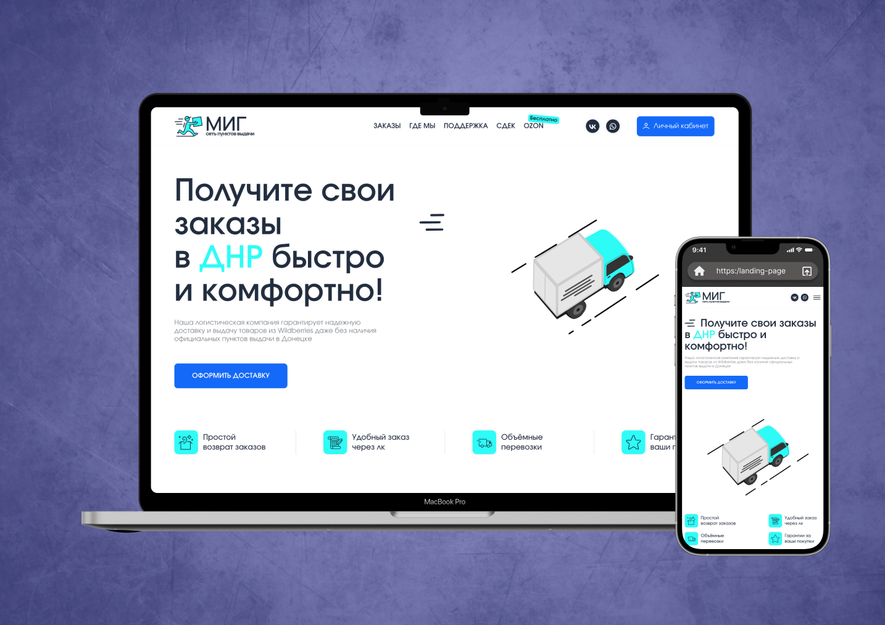

# 🚀 Mig Network Website – Your Reliable Pick-up Point Solution

This project is a **responsive website** for a logistics company that provides parcel pickup services from marketplaces (Wildberries, Ozon, Yandex Market).  
The main goal of development was to create a **lightweight, user-friendly, and maintainable** web application that showcases the company’s services and delivers a modern user interface.

---

## 📸 Preview

---

## 🎯 Project Goals
- ✅ Create a user-friendly website reflecting the company's services  
- ⚡ Ensure fast loading speed and cross-browser compatibility  
- 🛠️ Maintain a clean code structure for easy improvements and scalability  

---

## 🧩 Development Features
- 📐 Semantic **HTML5** markup for well-structured and accessible architecture  
- 🎨 **CSS3 + SCSS (Sass)** for styling with modularity and reusability  
- 🏷️ **BEM methodology** for organized class naming and scalability  
- 📱 Responsive layout with **Flexbox** and **CSS Grid**  
- ⚙️ **JavaScript** for interactive elements and dynamic behavior  
- 🔄 **Gulp + Webpack** for task automation:  
  - SCSS compilation  
  - Minification  
  - Image optimization  
  - Hot-reload during development  

---

## 🛠️ Tech Stack
| Technology  | Purpose |
|-------------|---------|
| **HTML5**   | Structure |
| **CSS3 / SCSS** | Styling & maintainability |
| **BEM**     | Clean and scalable code |
| **Flexbox & Grid** | Responsive design |
| **JavaScript** | Dynamic functionality |
| **Gulp & Webpack** | Build automation |

---

✨ The chosen **technology stack** ensures stable performance, ease of development, and long-term support.
